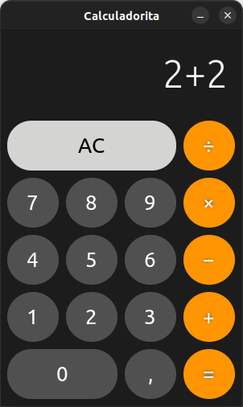

# Calculadorita

A calculator app writen in Vala and GTK+ for GNU/Linux by Argentinian guy 🇦🇷 🖱️



## How to build this app locally?

1. Install required dependencies:
  * **Ubuntu:**
    ```bash
    sudo apt install build-essential desktop-file-utils gettext gobject-introspection libgee-0.8-dev libgirepository1.0-dev libglib2.0-dev libgtk-4-dev libxml2-dev libxml2-utils meson cmake valac valadoc libmatheval-dev python3
    ```

2. Configure installation target directory and prepare the source code:
    ```bash
    meson build --prefix=/usr
    ```

3. Compile the source code and install the app on your system:
    ```bash
    cd build
    ninja
    ninja install
    ```

# Uninstall this app from you system?

To remove the application files from your system, run next command from the root of the project:
```bash
sudo ninja -C build uninstall
```